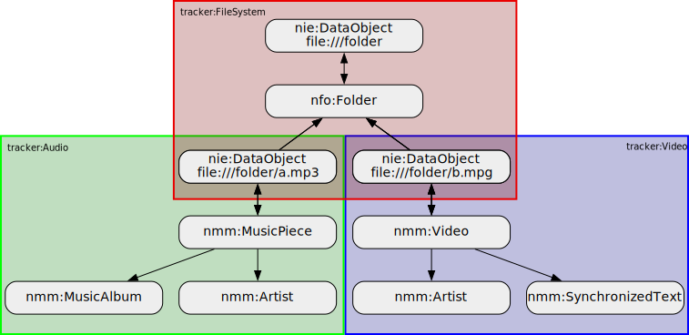

# SPARQL endpoint

## Introduction

The filesystem indexer SPARQL endpoint can be contacted at the
`org.freedesktop.Tracker3.Miner.Files` D-Bus name, use the
Tracker SPARQL library to set up a connection to it.

```python
#!/bin/env python3
import gi
gi.require_version('Tracker', '3.0')
from gi.repository import Tracker
conn = Tracker.SparqlConnection.bus_new('org.freedesktop.Tracker3.Miner.Files')
```

```bash
$ tracker3 sparql -b org.freedesktop.Tracker3.Miner.Files -q \
    "SELECT ('hello world' AS ?str) { }"
```

You should not provide access within flatpaks to this D-Bus name.
Access from within the sandbox is handled through the
[Tracker portal](https://gnome.pages.gitlab.gnome.org/tracker/docs/developer/sandboxing.html).

Data is offered in the format of the Nepomuk ontology, see
the [Nepomuk documentation](https://gnome.pages.gitlab.gnome.org/tracker/docs/developer/ontologies.html#nepomuk)
to learn about the different classes and properties that may be
handled through this ontology.

## Graphs

The filesystem indexer uses the following graphs to store data:

- `tracker:FileSystem`
- `tracker:Documents`
- `tracker:Audio`
- `tracker:Video`
- `tracker:Pictures`
- `tracker:Software`

See how the Tracker portal [uses graphs](https://gnome.pages.gitlab.gnome.org/tracker/docs/developer/sandboxing.html#how-it-works)
as the data units to perform isolation between clients.

The `tracker:FileSystem` graph contains all nfo:FileDataObject
objects representing the filesystem structure, and vertebrates
all the remaining "content" graphs. All other graphs contain the
nie:InformationElement objects that represent the various
media (documents, videos, ...), each of those graphs gets
populated only with the relevant media, and miscellaneous
data (e.g. audio albums and performers)



This way to partition the data is enabled by the split between
interpretation and content present in the Nepomuk ontology,
read more [about its design](https://gnome.pages.gitlab.gnome.org/tracker/docs/developer/nie-ontology.html#overview).
